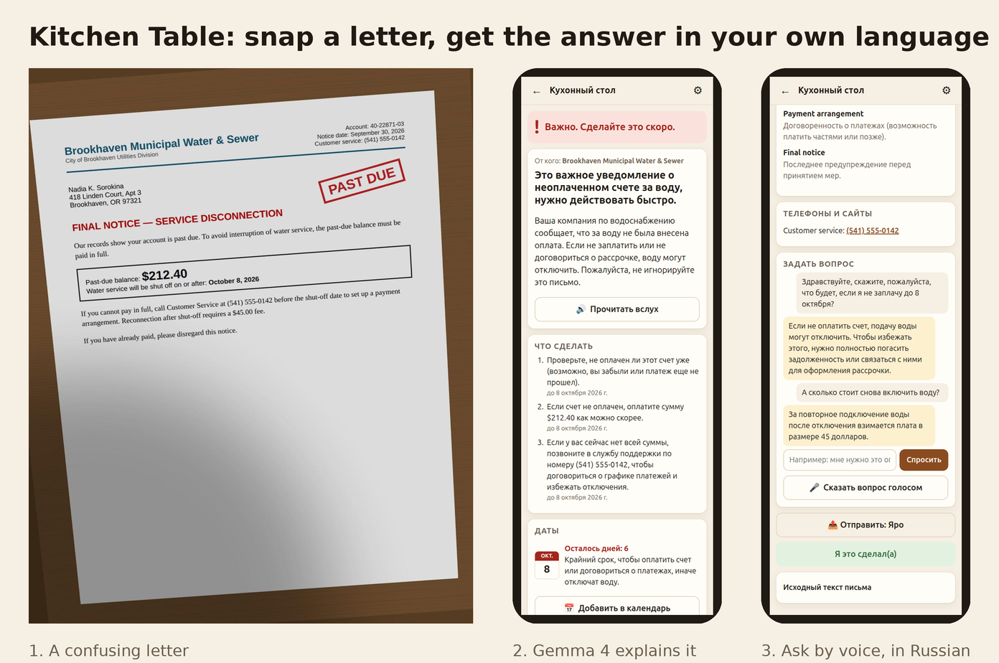

# Kitchen Table

[](https://github.com/pyaroslav/kitchen-table/actions/workflows/tests.yml)

**Snap a photo of a confusing letter. Get a plain answer in your own language. The letter never leaves the house.**

Kitchen Table is a small app for a parent who gets mail they can't fully read: utility bills, insurance statements, jury summonses, "FINAL NOTICE" envelopes, and the scams that are designed to look exactly like them. They take a photo on their phone; a computer at home runs **Gemma 4** locally through **Ollama** and answers:

- a traffic-light verdict: *nothing to do*, *you need to do something*, *important, do it soon*, or *careful, this looks like a scam*,
- what the letter says, in 2–4 plain sentences in **their** language (18 languages),
- what to do, by when (with an *Add to calendar* button), and how much money is involved,
- the hard words explained, the warning signs if it's suspicious,
- answers to follow-up questions, **typed or spoken** in their language, read aloud,
- a one-tap note to the family member who usually handles the paperwork.



**40-second walkthrough** (captions in English): [GIF](docs/kitchen-table-demo.gif) · [MP4](docs/kitchen-table-demo.mp4)

## Why local

The mail an older person gets is a map of their life: medications, bank balances, Medicare numbers, debts, court dates. Kitchen Table sends none of it to anyone, and only phones paired by QR code can reach it. The photo is processed on a computer in the same house, EXIF/GPS metadata is stripped, the photo itself is discarded after reading, and only the text is kept in a local SQLite file. Unplug the router and it still works; there are no API keys, no accounts, and no per-letter cost.

## How it works

```
phone (browser, same Wi-Fi)                        home computer
───────────────────────────                        ─────────────────────────────────────────────
 📷 photo(s) ───────────────────────────────▶  photo-quality check (brightness/contrast/blur)
                                                 └─ poor? auto-contrast + sharpen, mark low confidence
                                               Pass 1  Gemma 4 (vision): photo → exact transcript
                                               rules   deterministic scam red flags on the transcript
                                               Pass 2  Gemma 4 (JSON schema): transcript → explanation
                                                        in the reader's language
                                               code    date maths, "days left", verdict overrides:
                                                        strong scam rule ⇒ scam warning
                                                        deadline ≤ 7 days ⇒ urgent
                                                        bad photo ⇒ never "nothing to do"
 ◀──────────────── verdict, steps, dates, words, warning signs
 🎤 spoken question (16 kHz WAV, made on the phone) ─▶ Gemma 4 e4b hears it (26b can't take audio)
 ◀──────────────── answer in their language, read aloud by the phone
```

The model reads and explains. **Code owns everything a parent should never have to trust a model on**: arithmetic on dates, and the rule that a letter asking for gift cards, a Bitcoin ATM, secrecy from your bank, or a fee "because we're not the government" is always a scam warning, whatever the model says.

## Results

30 fictional letters (bills, shut-off notice, EOB, jury summons, property tax, debt-collection notice, look-alike "official" mailers, five kinds of scam), photographed on a "kitchen table" with skew, shadow and blur. Full method and caveats in [EVAL.md](EVAL.md).

| Model | Right verdict | Never unsafe | Scams caught | Deadlines found | Answer in the right language | Time / letter (RTX 5090) |
|---|---|---|---|---|---|---|
| gemma4:26b | 30/30 | 30/30 | 8/8 | 100% | 100% | ~3.5 s |
| gemma4:e4b | 29/30 | 30/30 | 8/8 | 92% | 100% | ~2.7 s (~39 s on CPU only) |
| gemma4:e2b | 25/30 | 25/30 | 6/8 | 88% | 3% | ~2 s |

**Use `gemma4:e4b` or bigger.** `e2b` answers in English no matter what language you ask for.

## Run it

You need [Ollama](https://ollama.com) (0.35 or newer for Gemma 4) and Python 3.11+.

```bash
git clone https://github.com/pyaroslav/kitchen-table && cd kitchen-table
./start.sh                       # pulls gemma4:e4b (6.6 GB) the first time; also does voice
KT_MODEL=gemma4:26b ./start.sh   # better reading, needs a ~24 GB GPU
```

It prints a **QR code**. Scan it with the parent's phone camera (same Wi-Fi) once: that pairs the phone and opens the app. Pick their language, type your name as the helper, and use *Add to Home Screen*.

**Only paired devices can read letters.** The server is on the home Wi-Fi, so without pairing anyone on that network (guests, a smart TV) could open the API. The QR code carries a secret key; the phone keeps it as an HttpOnly cookie. The computer itself never needs pairing. `./start.sh --new-key` unpairs every phone.

| Setting | Default | |
|---|---|---|
| `KT_MODEL` | `gemma4:e4b` | reads and explains |
| `KT_EAR_MODEL` | `gemma4:e4b` | hears spoken questions when `KT_MODEL` can't |
| `OLLAMA_HOST` | `http://127.0.0.1:11434` | |
| `KT_DATA` | `./data` | SQLite file and cached UI translations |

**Voice on plain HTTP:** phone browsers only allow in-page microphone recording on HTTPS or localhost. On home Wi-Fi the 🎤 button opens the phone's own voice recorder instead; the recording is converted to 16 kHz WAV on the phone and sent the same way.

## Tests and evaluation

```bash
.venv/bin/pip install -e '.[dev]' && .venv/bin/python -m pytest      # 27 model-free tests
.venv/bin/python eval/make_letters.py                                # re-render the letter set (needs Chrome)
.venv/bin/python eval/run_eval.py --models gemma4:e4b --lang ru --set all
.venv/bin/python eval/report.py
```

## What it is not

It's not legal, medical or financial advice, and it says so in the only way a parent will hear: every suspicious or unclear letter ends with "call [your helper] first". It reads typed letters well; handwriting is untested.

## License

MIT. Every organisation, person, address and phone number in `eval/letters/` is invented; phone numbers use the reserved 555-01xx range.
